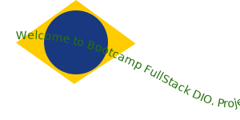

# Bootcamp FullStack DIO - Desafio Git/Github

> Repositório do projeto

## Objetivo

> Compartilhar anotações e exercícios

### Principais comandos Git

> Prepara um projeto para vesionamento com Git

    git init

> Clna um repositório remoto

    git clone <endereço do repositório>

> Define o usuário global git

    git config --global user.name "username"

> Verifica o status dos arquivos do projeto

    git status

> Adiciona arquivos ao versionamento
 
    git add *

> Faz um commit identificado também por uma mensagem

    git commit -m "mensagem no commit"

> Envia os arquivos para o repositório remoto

    git push

> Recebe atualizações do reposítório remoto

    git pull

## Anotações

- [Saiba tudo sobre Git - Livro gratuito](https://git-scm.com/book/en/v2)